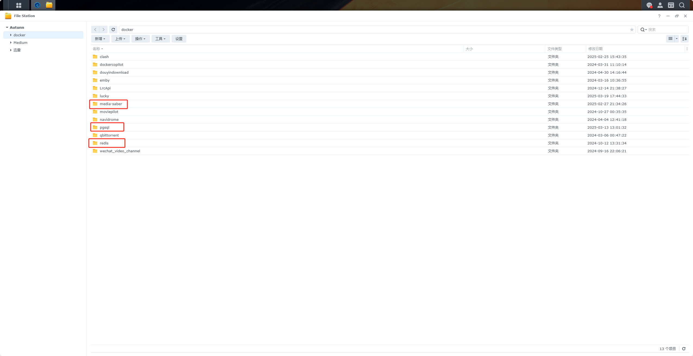

:::note 致谢
感谢`@WhoisKB` 为大家带来，群晖 NAS 的 Media Saber 安装教程。
:::

:::danger
- 为了项目的安全性，请一定要注意：**请勿外传！请勿外传！请勿外传！请勿外传！请勿外传！**
- 项目运行需要自行添加 **激活密钥**，这里不说明是什么
:::

打开群晖 File Station，在 `docker` 目录下新建 `Media-Saber` 文件夹，`Media-Saber` 目录下新建 `config` 文件夹。



记得给文件夹写入权限。


如果以前安装过 nastools，可以直接使用 nastools 的 `config` 文件夹，可以无损保留配置升级，nastools 必须是 3.0 以上版本。

推荐使用 docker compose 的方式部署，首先创建 `docker-compose.yaml` 文件，放置在 `Media-Saber/config` 文件夹下，docker-compose.yaml 文件的内容可参考 [Docker Compose](/guide/install/start/#docker-compose)，根据实际情况修改即可。


其中 `volumes` 下条目中的 **配置文件路径** 及 **媒体库路径** 需要根据实际存储的位置进行填写，可在配置文件夹及媒体库文件夹上点击 `右键 - 属性` 查看。


接下来就是根据 docker-compose.yaml 文件创建并运行 Media Saber 容器，这里使用 SSH 工具操作，用 PuTTY 填入群晖的 IP 及 SSH 端口。


连接到 SSH 后按提示输入群晖的用户名 + 密码。输入密码的时候是看不见的，所以提前查看一下输入法大小写。


输入密码之后进入应该是在这个界面，执行以下命令：

```shell 
sudo -i
```
再输入一次密码，获得 root 权限。


输入命令：

```shell
cd /volume1/docker/Media-Saber
```

会进入 `docker/Media-Saber` 目录下


输入命令：

```shell 
docker-compose up -d
```

显示如图：


显示 `creating media-saber...done`，说明容器已启动，使用群晖 IP + 3000 端口访问即可。


群晖 7.2 支持在 WEBUI 中通过 docker compose 创建容器，只需要将 docker-compose.yaml 文件中的命名按照自己的实际情况修改完后，复制到 7.2 新版的 docker 配置中，保存运行即可。

:::tip
群晖用户注意一个经常遇到的问题：启动日志报 inotify instance limit reached、inotify watch limit reached 等与 `inotify` 相关错误，可以查看 [常见问题](/guide/start/problem)
:::