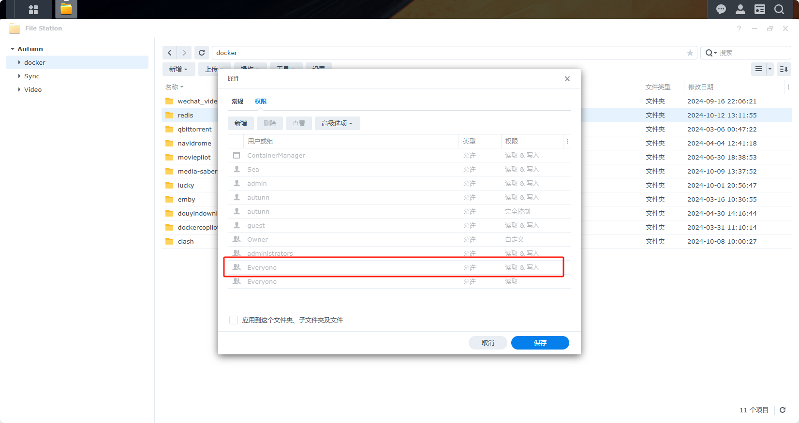
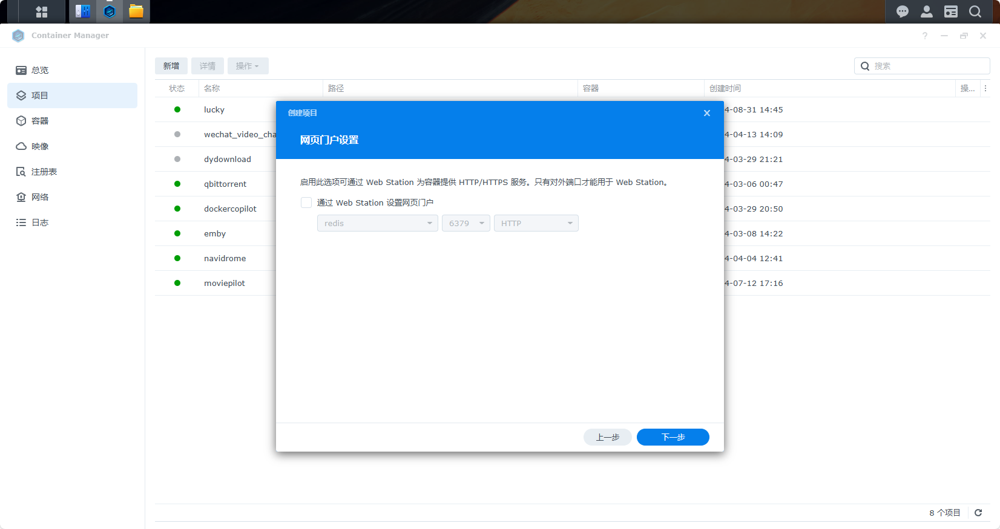
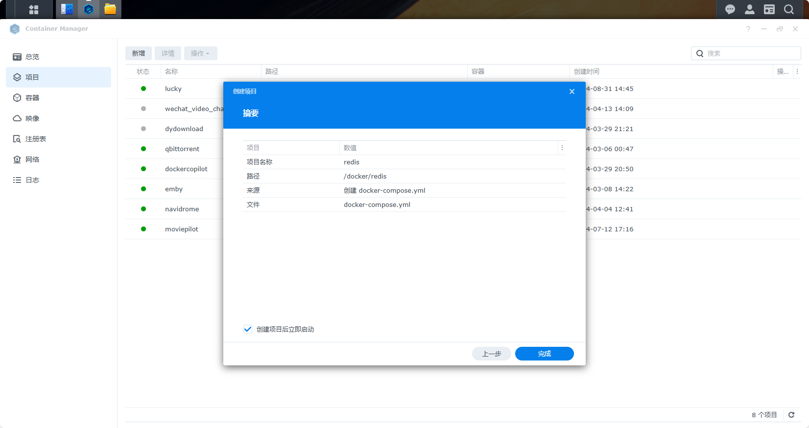
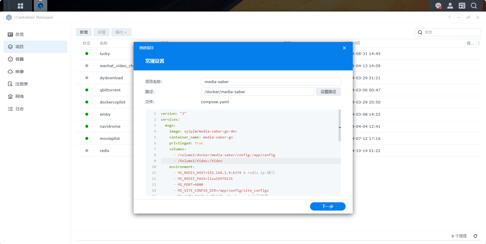

:::danger
- 为了项目的安全性，请一定要注意：**请勿外传！请勿外传！请勿外传！请勿外传！请勿外传！**
- 项目运行需要自行添加 **激活密钥**，这里不说明是什么
:::

打开群晖 File Station，在 `docker` 目录下新建 `redis` `Media-Saber` 两个文件夹，`redis`目录下新建data 文件夹 `Media-Saber` 目录下新建 `config` 文件夹。


记得给文件夹写入权限。



群晖 DSM 7.2用户推荐使用Container Manager直接部署。
这里，将redis和media-saber进行分开部署
打开Container Manager在项目中点击新增，输入项目名称redis，设置路径为刚刚创建的路径，来源选择创建docker-compose.yaml，在代码框中粘贴以下代码
```
version: "3.3"
services:
  redis:
    image: redis:latest
    container_name: redis
    restart: always
    ports:
      - 6379:6379
    environment:
      - REDIS_PASSWORD=**********
    volumes:
      - /volume1/docker/redis/data:/data
```

:::warning
将`/volume1/docker/redis/data`修改为你自己的文件夹路径,在`REDIS_PASSWORD`项给你的redis设置你的密码
:::


点击下一步



再次点击下一步



点击完成，开始自动从dockerhub拉取redis映像，并自动进行构建

media-saber部署，方法同redis
在Container Manager在项目中点击新增，输入项目名称media-saber，设置路径为刚刚创建的路径，来源选择创建docker-compose.yaml，在代码框中粘贴以下代码
```
services:
  msgo:
    image: xylplm/media-saber:go-dev
    container_name: msgo
    networks: 
      - ms_network
    environment:
      - PUID=0
      - PGID=0
      - UMASK=022
      - TZ=Asia/Shanghai
      - MS_PORT=3005
      - MS_AUTH_EMAIL=name@sample.com
      - MS_AUTH_SLOGAN=大佬牛逼
      - MS_LOG_LEVEL=debug
      - MS_REDIS_HOST=ms-redis:6379
      - MS_REDIS_PASS=**********
      - MS_TIMEOUT=60000
      - MS_PGSQL_USERNAME=postgres
      - MS_PGSQL_PASSWORD=ms888888
      - MS_PGSQL_PATH=ms-pgsql
      - MS_PGSQL_PORT=5432
      - MS_PGSQL_DBNAME=ms
    restart: unless-stopped
    privileged: true
    volumes:
      - /volume2/docker/media-saberGo/ms/config:/app/config
      - /volume2/video:/video
    ports:
      - "3005:3005"

  redis:
    image: redis:latest
    container_name: ms-redis
    restart: unless-stopped
    networks: 
      - ms_network
    volumes:
      - ./redis/config:/data
    environment:
      - TZ=Asia/Shanghai
      - GOSU_VERSION=1.17

  pgsql:
    image: postgres:17-alpine
    container_name: ms-pgsql
    restart: unless-stopped
    networks: 
      - ms_network
    volumes:
      - /volume2/docker/media-saberGo/pgsql/data:/var/lib/postgresql/data
    environment:
      - POSTGRES_USER=postgres
      - POSTGRES_DB=ms
      - POSTGRESQL_WAL_COMPRESSION=lz4
      - POSTGRESQL_MAX_CONNECTIONS=2048
      - POSTGRES_PASSWORD=ms888888

networks:
  ms_network:
    name: ms_network
    driver: bridge
    ipam:
      config:
        - subnet: 172.31.126.0/24
          gateway: 172.31.126.1
```



:::warning
在部署media-saber时，请修改以下变量的值，其余变量不用动，认证信息请勿分享！！！
:::

```
# redis密码:**********
# media-saber访问端口:3000
# 宿主机media-saber配置文件路径：/volume1/docker/media-saber/config
# 宿主机media-saber媒体库路径：/Volume1/media
# media-saber认证邮箱:name@sample.com
# media-saber认证口令:大佬牛逼

```
点击完成，开始自动从dockerhub拉取media-saber映像，并自动进行构建
