> 为了项目的安全性，请一定要注意：`请勿外传！请勿外传！请勿外传！请勿外传！请勿外传！`，需要自行添加`激活密钥`，这里不说明是什么

由于现在推荐使用的是beta版本，此版本更新比较频繁，因此强烈推荐大家使用项目组 @唯依 大佬的docker copilot【下文统一缩写dc】来更新。

dc是一个主打简单操作的docker管理工具：
- 容器更新：可以直观的看到容器是否有更新然后一键更新，也可以很方便的更换容器版本
- 镜像管理：对于不使用的镜像可以一键清理
- 容器的备份与恢复：万一不幸遇到盘挂了或者更换设备，可以方便的一键复活。

dc项目GitHub地址：<https://github.com/onlyLTY/dockerCopilot>。好用的话可以打个星给予鼓励哦~

>bug反馈和建议联系方式： 部署遇到的问题和想要反馈的话都可以直接在上述的Github地址提issue，或者发送到唯依佬的邮箱：`onlylty@lty.wiki`

## 安装

### 绿联篇

1、打开绿联的Docker，点击镜像管理-本地镜像-添加，输入`0nlylty/dockercopilot:UGREEN`，点击确认后会跳出选择版本的弹窗，继续点击确认即可，然后等待镜像拉取完成。


2、找到刚刚拉取的镜像，点击创建容器，这里要使用`高级模式`，可以勾选创建后启动容器，然后点击下一步

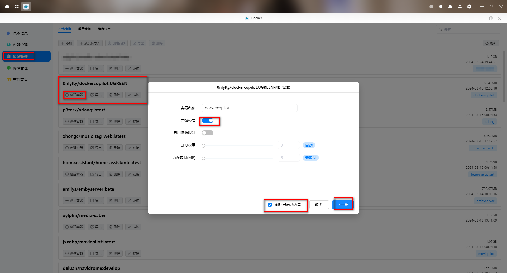


3、基础设置：重启策略设置为`容器退出时总是重启容器`

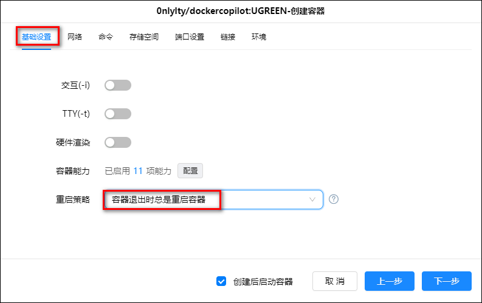


4、网络：设置为host模式


5、存储空间：自定义`/data`对应的路径，同时类型要改为读写


6、环境：设置secretKey的值，也就是你的密码，注意：密码长度要大于8位，且不能为纯数字


然后点击下一步，点击完成。至此，安装完成。

### ssh篇

>警告！！！群晖必须用ssh安装，否则容易出现问题

1、连接ssh，由于各系统不一样这里就不赘述，可自行使用搜索引擎

2、ssh命令，自行修改两个中文处的地方：

```
docker run -d --privileged -p 12712:12712 -e secretKey=自己设置密码，需要大于八位且非纯数字 -e DOCKER_HOST=unix:///var/run/docker.sock -e hubURL=https://docker.nju.edu.cn -v /var/run/docker.sock:/var/run/docker.sock -v 自己设置路径:/data --restart=always --name dockerCopilot 0nlylty/dockercopilot:UGREEN
```

3、ssh执行修改好的命令。

### 极空间篇

1、打开极空间Docker，点击镜像-仓库-自定义拉取


2、输入`0nlylty/dockercopilot:ZSPACE`，点击拉取，等待拉取完成。

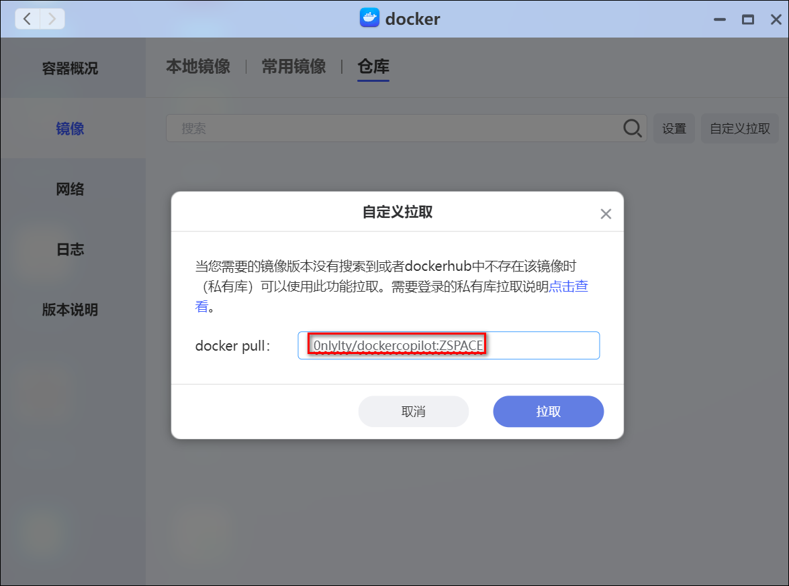

3、在本地镜像找到拉取到的dc镜像，点击`添加到容器`


4、基本设置：勾选`极空间开机后自动启动此容器`

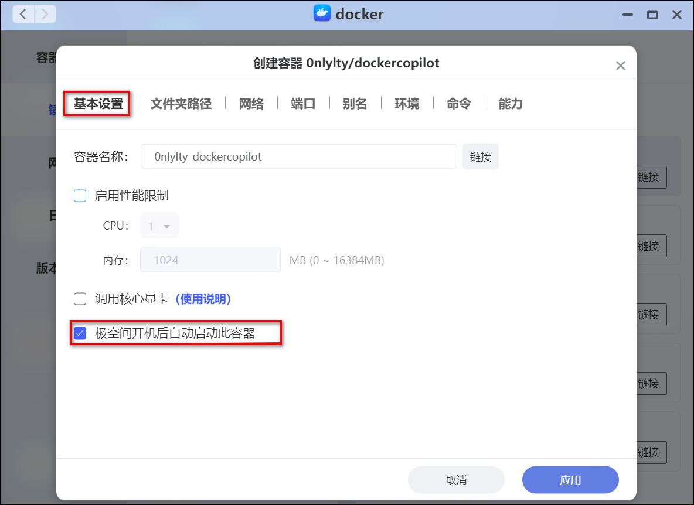

5、文件夹路径：需要挂载/data目录来保存备份容器的文件，以及未来可能的配置文件


6、网络：必须要修改为host模式


7、环境：account填写极空间的管理员账号。secretKey填写一个自己设置的不少于8位的非纯数字密码

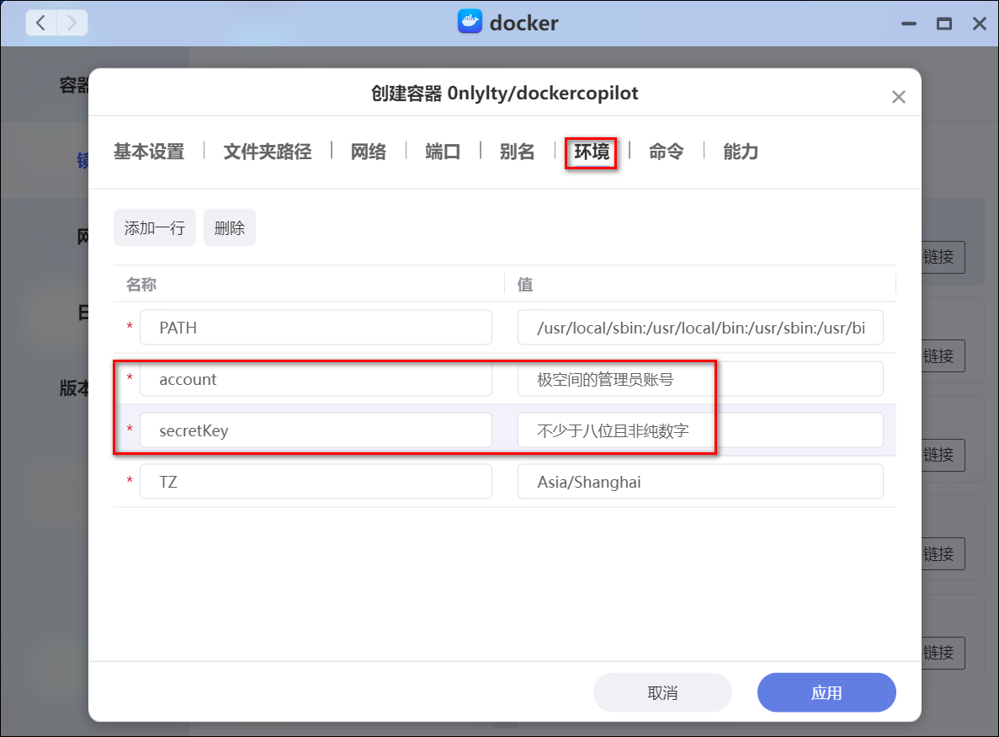

8、点击应用。至此安装完成

## 使用

### 登录

1、在浏览器输入 `nas的ip:12712` ，打开页面后可以看到一个登录框，会要求输入网址、端口、密钥，填写完后点击ok，如果正确的话，登录框就会消失。如果没有消失就说明有东西输错了，请仔细检查

- 网址：写你nas的ip，如果你是用域名访问就写域名
- 端口：12712，这个是固定的。
- 密钥 ：刚刚设置的secretKey，如果忘记的话可以在容器的环境看。

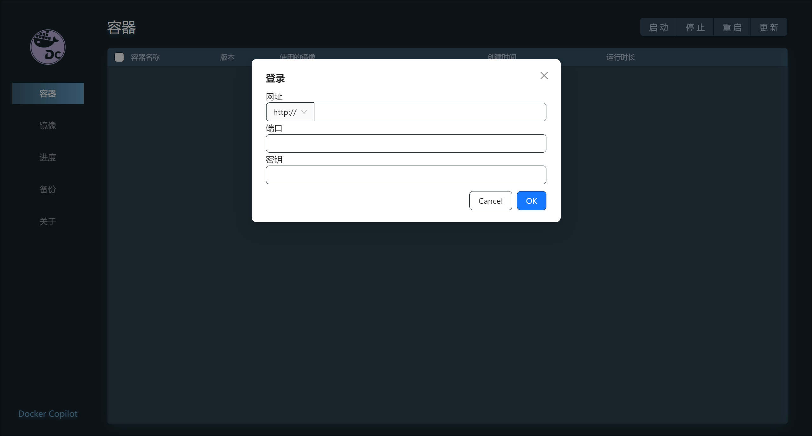

2、这是一个正常登录后的页面。会显示容器的状态、版本状态、使用的镜像和创建的时间这样一些基础信息。

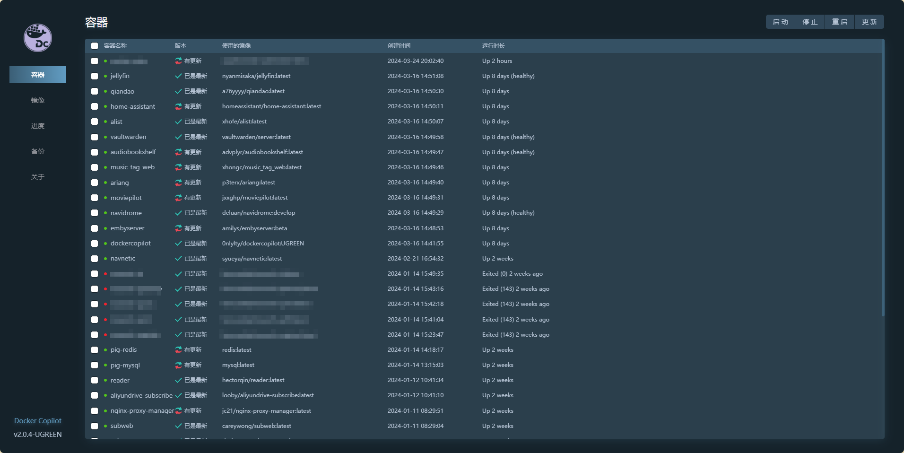

### 更新

1、可以通过勾选多选框，对容器批量启动、停止、重启和更新。

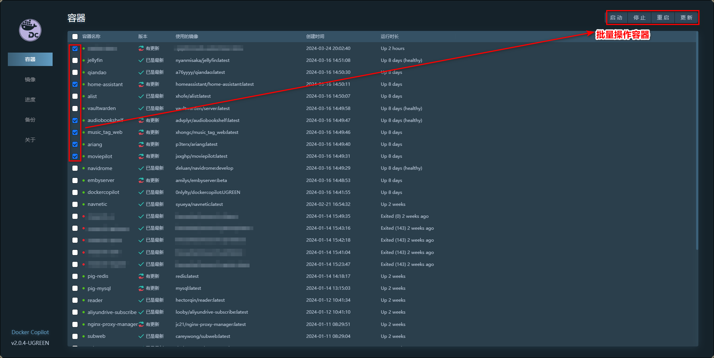

2、可以点击想要操作的容器，右侧会有弹出栏，这样就可以单独对容器执行重命名、更换版本、更新等操作了。

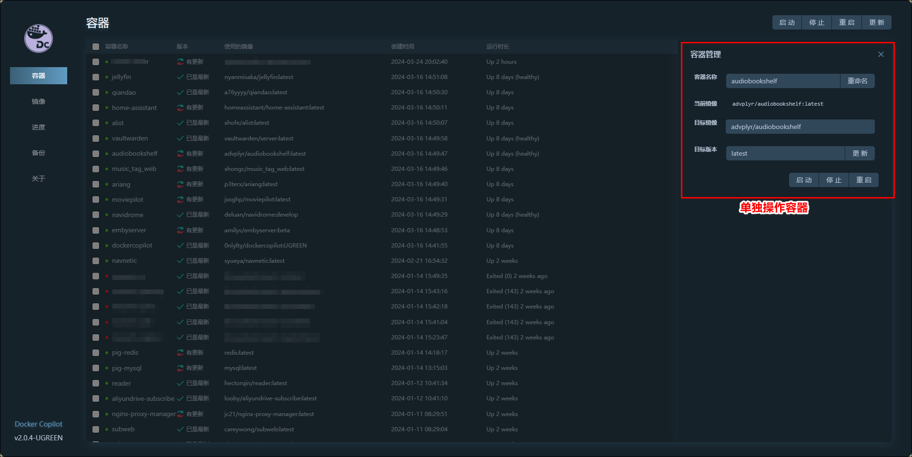

比如现阶段需要把正式版本的ms更新到测试版本，你可以只需要把版本号改成`latest-beta`然后点击更新即可。


3、如果进行了更新操作，右上角会有弹窗提示，且可以在进度里查看更新进度。


### 镜像

1、点击镜像目录，可以清晰的看到哪些镜像在使用中，哪些已经没有使用了。我们可以手动选择未使用的镜像然后点击右上角的删除来清理镜像。

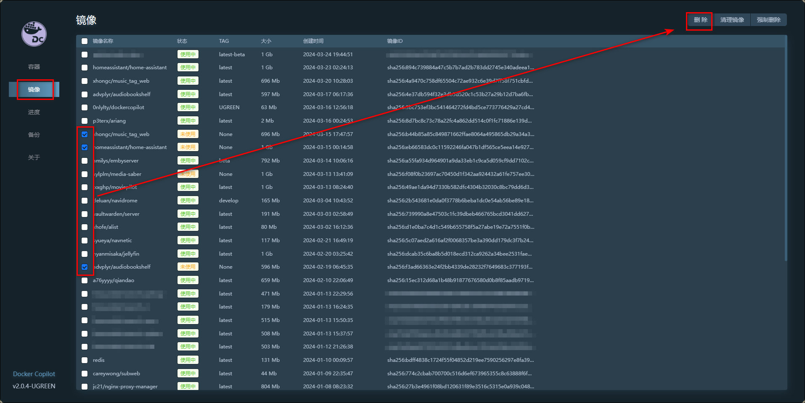

2、可以直接点击右上角的清理镜像，根据条件批量清理镜像。

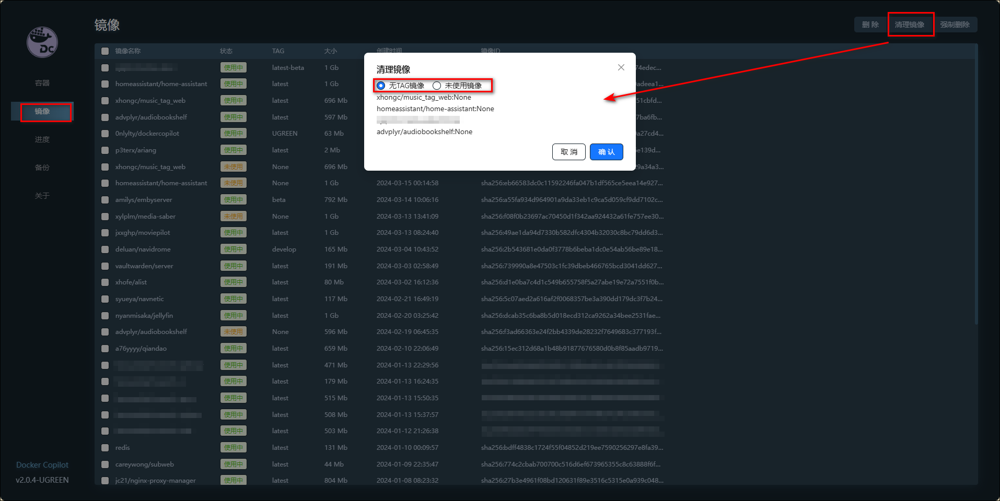

3、有时候会有特殊情况，普通删除无法删除镜像，这时候可以使用强制镜像，但请谨慎使用强制删除

4、清理完镜像后右上角会有删除成功的提示。


### 备份

点击备份目录，可以备份容器的创建参数和根据备份文件恢复容器。

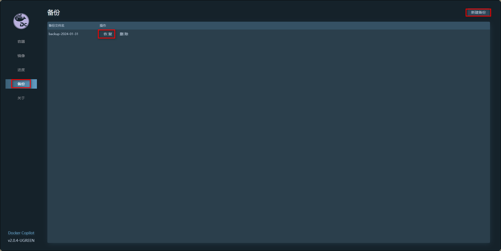

### 更新自身

dc可以通过左下角的`更新程序`按钮来更新自身。这个按钮只有在有更新的时候才会显示，如果没有更新则不会显示。

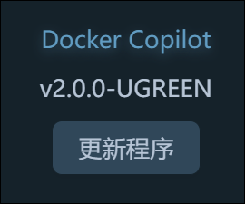


