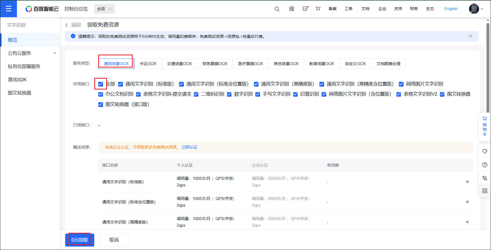
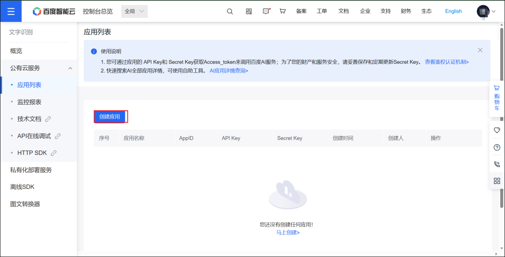
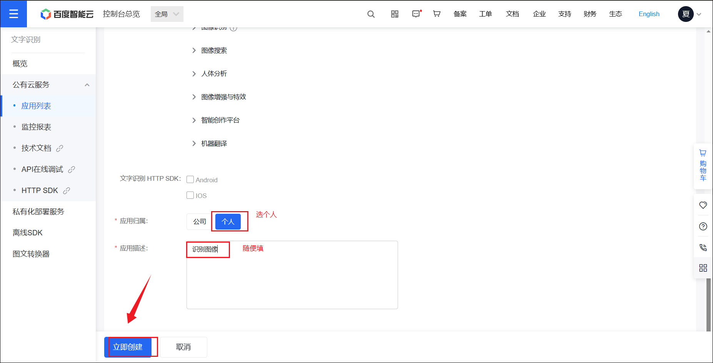
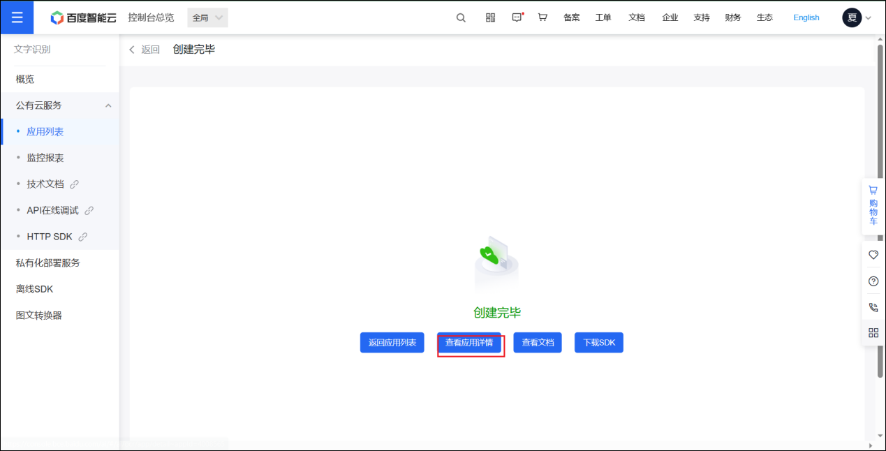
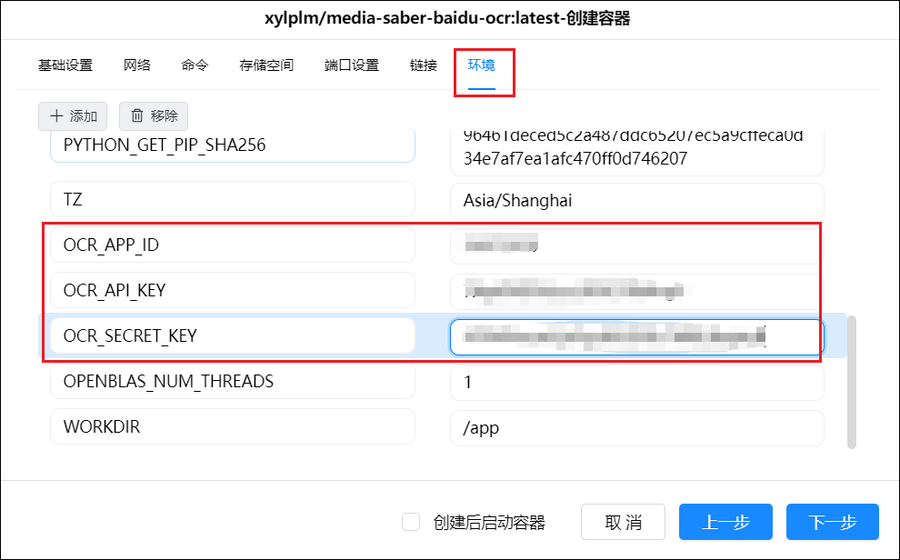
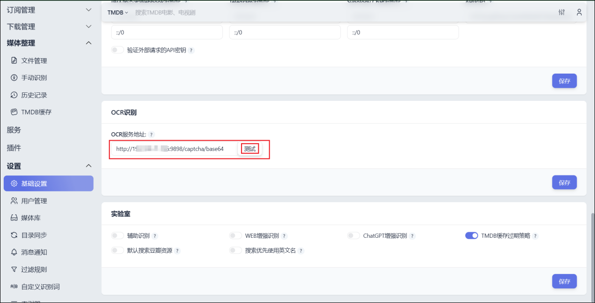

OCR 服务主要用于网站登录更新 cookie 以及特殊站点签到等识别验证码场景。

默认 NAStoolOCR 服务，但是作者已经停更，可能会失效。 media saber 已去掉 NT 默认服务地址，需要自己填写。

如需修改其他 OCR 服务地址，可以在系统设置-基础设置-OCR 识别-OCR 服务地址里修改：

**第三方 OCR 服务**

*NT 原作者的服务地址*

本项目基于 NT 继续发展，因此可以继续使用 NT 原作者的 OCR 服务。

```
https://nastool.cn/captcha/base64(已作废)

新的地址：
https://movie-pilot.org/captcha/base64
```

在系统设置-基础设置-OCR 识别-OCR 服务地址里修改。

*DDSDerek 的 OCR 地址*

热心网友 DDSDerek 大佬搭建的 OCR 服务。速度比较慢，但是也能作为一个备用方案。

```
https://ocr.ddsrem.com/captcha/base64
```

在系统设置-基础设置-OCR 识别-OCR 服务地址里修改。

**Docker：专用 Paddle OCR 服务镜像[暂不可用]**

media saber 开发了 OCR 服务镜像，大家可以部署自己的 OCR 服务，防止失效：

- 采用 NT 原作者相同实现方式的 paddle OCR 服务。
- Paddle 充分调用本地计算机性能，无需付费使用第三方接口，成本低，识别率高，但本地资源消耗大
- 注意：ARM 不支持该镜像。ARM 请使用百度 OCR 或者其他服务地址。

Docker 镜像地址：

```
https://hub.docker.com/r/xylplm/media-saber-paddle-ocr
```

通过【设置-基础设置-OCR 识别-OCR 服务地址】修改
填写 docker 容器地址加端口及接口地址，比如本地的：

```
http://127.0.0.1:9899/captcha/base64
```

**Docker：专用 Baidu OCR 服务镜像**

media saber 开发了 OCR 服务镜像，大家可以部署自己的 OCR 服务，防止失效。

Docker 镜像地址

```
https://hub.docker.com/r/xylplm/media-saber-baidu-ocr
```

因为此镜像创建容器时需要填写 `OCR_APP_ID`、`OCR_API_KEY`、`OCR_SECRET_KEY` 三个环境变量，否则不能正常识别到图片。所以我们先去申请百度 OCR。

**1、获取 API、密钥**

先访问`https://cloud.baidu.com/`注册登录百度智能云 (无百度账号的先注册账号)，然后选择产品-文字识别-文字识别。


点击立即使用


点击去领取


进入领取页面后，选择通用场景 OCR，待领接口选择全部，点击下方的 0 元领取。



跳出领取成功界面，点击前往应用列表


点击创建应用



创建应用界面处的应用名称：自定义个即可，接口选择：文字识别选择全部


往下滑应用归属选择个人，应用描述随便填。然后点击立即创建。



来到创建完毕界面，选择查看应用详情



获得需要的三个数据：OCR_APP_ID、OCR_API_KEY、OCR_SECRET_KEY ，到时候填进环境变量


**2、容器创建**

以绿联为例来示范。

在镜像仓库搜索并下载 media-saber-baidu-ocr 镜像。


创建容器，基础设置重启策略这里选择退出时重启。


本地端口填写 9898（如果未被占用的话）。


环境这三个变量填写刚刚获取的三个值，然后点击下一步点击完成，完成容器创建。



**3、MS 添加 OCR 服务**

在基础设置-ocr 识别里填写 media-saber-baidu-ocr 的容器的地址加端口及接口地址，比如`http://127.0.0.1:9898/captcha/base64`（把 127.0.0.1 改成你自己的 ip 地址）。然后保存后（先保存先保存！！！）点击测试。



跳出测试成功即可。

