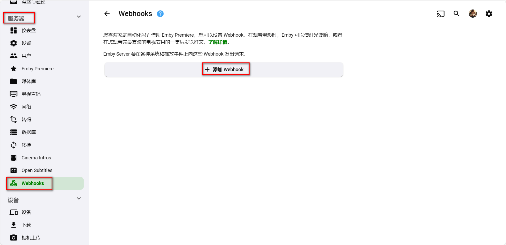
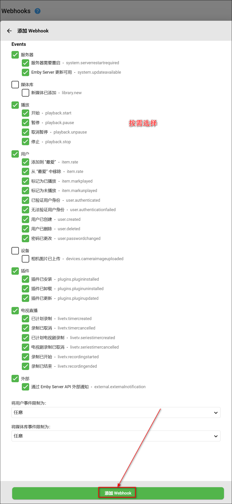
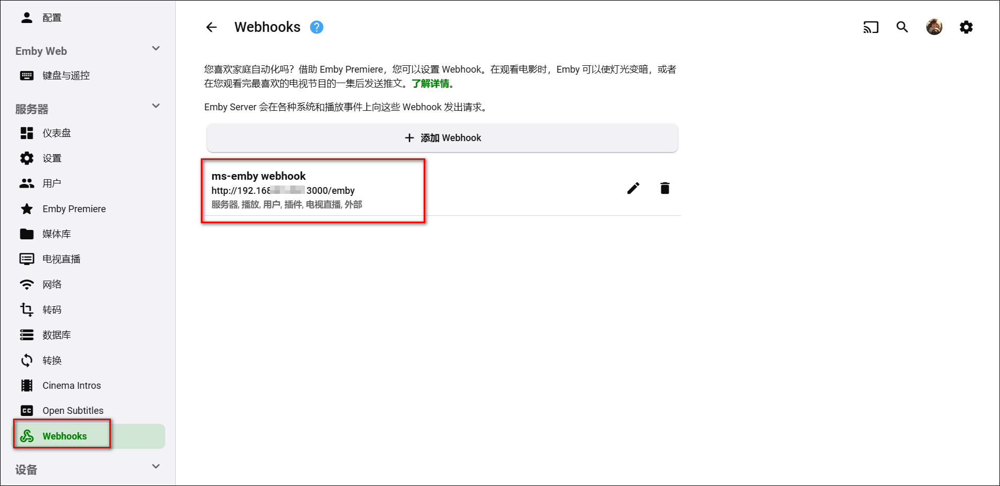
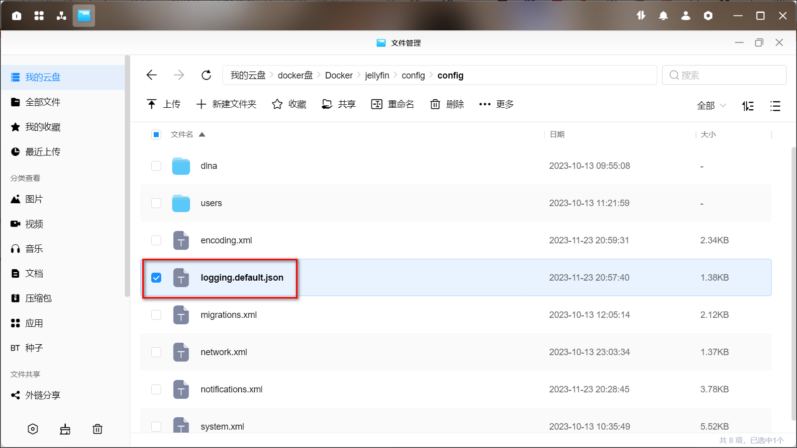

## emby

1、打开emby设置-服务器-Webhook，点击添加Webhook。



2、名称自定义即可，URL填写 ms地址/api/v1/webhook/emby?apiKey=sk-xxx ，请求内容类型需要选application/json，填写，可以点击发送测试Webhook。


apiKey 获取如截图


3、此时ms应该会收到一条测试信息。


4、继续选择下面的事件和用户、媒体库，这里按需来选你想触发通知的一些选项即可，填完后点击添加Webhook。



5、至此Webhook设置完成。



6、这时我们在emby操作我们刚刚勾选的一些事件的话，ms会收到信息。比如：


## jellyfin

github文档说明：<https://github.com/jellyfin/jellyfin-plugin-webhook>。

1、打开jf控制台-插件，在插件目录里找到Webhook并点击。


2、点击安装Webhook。


3、安装完后会提示重启Jellyfin，按要求重启下即可，重启后状态显示active表示成功。


4、Server Url 填写 Jellyfin 服务器 URL，然后点击 Add Generic Destination 按钮新增一个Hook，并设置以下信息：

- Webhook Name：自定义Webhook名称
- Webhook Url：ms地址/jellyfin
- Notification Type：勾选你想触发通知的通知类型
- User Filter：勾选你想触发通知的用户
- Item Type：勾选你想监控的媒体类型
- Send All Properties (ignores template)和Template二选一即可，默认勾选Send All Properties (ignores template)。
- 点击Add Request Header，并新增一组：Key: Content-Type, Value: application/json

设置完后点击保存。


5、至此Webhook设置完成。


6、这时我们在jf操作我们刚刚勾选的一些通知类型的话，ms会收到信息。比如：


7、如果我们的Webhook没起作用的话，我们可以更改logging.default.json文件以输出Webhook的调试日志。



在文档中的"Serilog"下添加一行内容：

```json
"Jellyfin.Plugin.Webhook": "Debug"
```

添加后记得在`"System": "Warning"`的末尾添加个逗号。


