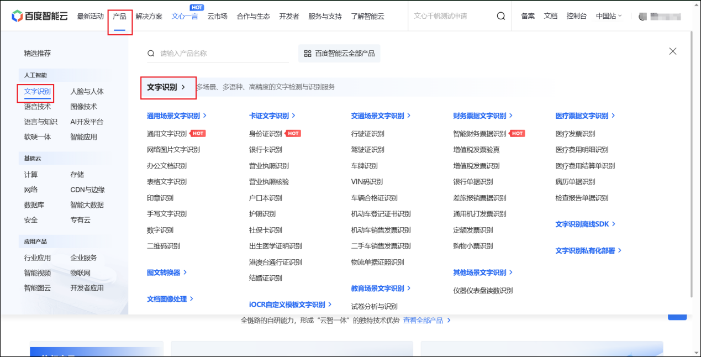
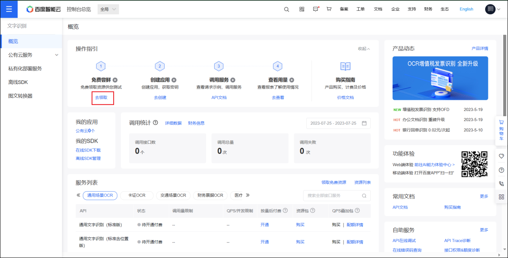

# 🔤 OCR服务配置指南

> OCR 服务主要用于网站登录更新 cookie 以及特殊站点签到等识别验证码场景。Media Saber 不提供任何 OCR 服务，请自行搭建或使用第三方服务。

---

## 📋 配置概览

在 [基础设置](/docs/system_settings/basic_settings/#_7%EF%B8%8F%E2%83%A3-%E6%9C%8D%E5%8A%A1%E9%85%8D%E7%BD%AE) 的"服务配置"部分，找到"OCR服务地址"进行配置：

**支持的服务类型：**
- 🌐 **第三方服务**：免费，依赖外部稳定性
- 🐳 **自建 Paddle OCR (Node.js版)**：PP-OCRv5模型，高识别率，轻量级本地部署，完全免费
- 🔍 **自建 Baidu OCR (Go版)**：GO高性能API调用，支持所有架构，资源占用极低

配置完成后请点击"测试"按钮验证服务有效性。

---

## 🌐 第三方 OCR 服务(轻度使用推荐，稳定性一般)

### Movie Pilot服务

本项目支持NT和Movie Pilot OCR服务格式。

```
https://movie-pilot.org/captcha/base64
```

**特点：**
- ✅ 免费使用，识别率高
- ✅ 无需配置，即用即可
- ⚠️ 依赖外部服务稳定性

> **注意：** 原地址 `https://nastool.cn/captcha/base64` 已作废

### DDSDerek OCR 服务

热心网友 DDSDerek 大佬搭建的备用服务。

```
https://ocr.ddsrem.com/captcha/base64
```

**特点：**
- ✅ 免费使用，可作备用
- ⚠️ 速度相对较慢
- ⚠️ 网络条件影响较大

---

## 🐳 自建 Paddle OCR 服务（完全免费，高识别率，本地部署）

### 服务特点

- ✅ **高识别率**：基于 PP-OCRv5 模型，验证码识别成功率 90%以上
- ✅ **高性能**：基于 Node.js + Fastify 框架，启动时间 2-3s
- ✅ **轻量级**：使用 eSearch-OCR 和 ONNX Runtime，内存占用约 150MB
- ✅ **易部署**：Docker 容器化部署，支持多架构，开箱即用
- ✅ **本地部署**：数据不出本地，安全可控
- ✅ **免费使用**：无API调用费用
- ✅ **兼容性**：API 与 Media Saber 完美兼容，也兼容 NT MP

### 性能对比

| 指标     | Node.js 版本 | Python 版本 | 改善     |
| -------- | ----------- | ------- | -------- |
| 镜像大小 | ~150MB      | ~1GB   | 85% ↓    |
| 内存占用 | ~150MB      | ~300MB   | 50% ↓    |
| 启动时间 | ~2-3s       | ~5-8s   | 60% ↓    |
| 识别速度 | ~100-200ms | ~200-500ms | 显著提升 |
| 并发处理 | 优秀        | 良好    | 显著提升 |

### Docker 部署

**镜像地址：**
```
https://hub.docker.com/r/xylplm/media-saber-paddle-ocr
```

#### 方式一：命令行部署（推荐）

```bash
docker run -d \
  --name media-saber-paddle-ocr \
  -p 9899:9899 \
  --restart=unless-stopped \
  xylplm/media-saber-paddle-ocr:latest
```

#### 方式二：Docker Compose 部署（推荐）

创建 `docker-compose.yml` 文件：

```yaml
version: "3.8"

services:
  media-saber-paddle-ocr:
    image: xylplm/media-saber-paddle-ocr:latest
    ports:
      - "9899:9899"
    environment:
      - TZ=Asia/Shanghai
    restart: unless-stopped
    container_name: media-saber-paddle-ocr
    deploy:
      resources:
        limits:
          memory: 1G
          cpus: '1.0'
        reservations:
          memory: 256M
          cpus: '0.5'
```

运行：

```bash
docker-compose up -d
```

### API 接口说明

**主要接口：**
- `POST /captcha/base64` - OCR 识别接口
- `GET /health` - 轻量级健康检查
- `GET /captcha/health` - OCR 服务状态检查
- `GET /` - 服务信息和欢迎页面

**请求格式：**
```json
{
  "base64_img": "图片的base64编码字符串"
}
```

**响应格式：**
```json
{
  "result": "识别出的验证码文本",
  "confidence": 0.95,
  "processing_time": 0.12
}
```

### 环境变量配置

- `HOST`: 绑定地址 (默认: 0.0.0.0)
- `PORT`: 绑定端口 (默认: 9899)
- `LOG_LEVEL`: 日志级别 (默认: info)

### 生产环境建议

**资源配置：**
- CPU: 2+ 核心
- 内存: 1GB+
- 磁盘: 1GB+

**服务地址配置：**
```
http://127.0.0.1:9899/captcha/base64
```

### 功能特性

- ✅ 图像预处理（缩放、降噪、边界处理）
- ✅ PP-OCRv5 高精度识别
- ✅ 自动模型初始化和管理
- ✅ 并发安全
- ✅ 优雅的错误处理
- ✅ 健康检查接口
- ✅ 云原生部署友好
- ✅ **兼容性**：API 与 Media Saber 完美兼容，也兼容 NT MP

---

## 🔍 自建 Baidu OCR 服务 （本地部署，低延时，高准确率）

### 主要改进

- ✅ **更高性能**：Go 原生并发支持，处理速度显著提升
- ✅ **更小体积**：最终 Docker 镜像仅约 20MB（原 Python 版本约 1GB）
- ✅ **更低内存**：内存占用减少约 80%
- ✅ **更快启动**：启动时间从秒级降到毫秒级
- ✅ **高识别率**：验证码识别成功率 90%以上
- ✅ **支持所有架构**：包括 ARM 设备（如树莓派、NAS）
- ✅ **Go 1.25 优化**：利用最新的 Go 编译器优化和性能改进

### 性能对比

| 指标     | Python 版本 | Go 版本 | 改善     |
| -------- | ----------- | ------- | -------- |
| 镜像大小 | ~1GB        | ~20MB   | 98% ↓    |
| 内存占用 | ~200MB      | ~40MB   | 80% ↓    |
| 启动时间 | ~3s         | ~50ms   | 98% ↓    |
| 并发处理 | 受限        | 优秀    | 显著提升 |
| CPU 使用 | 较高        | 较低    | 30-50% ↓ |

### 技术栈

- **语言**: Go 1.25+
- **Web 框架**: Gin
- **图像处理**: 原生 Go image 包
- **HTTP 客户端**: 原生 net/http
- **容器化**: Docker 多阶段构建

### 功能特性

- ✅ 图像预处理（二值化、降噪、边界处理）
- ✅ 百度 OCR API 集成
- ✅ 自动 Token 管理和刷新
- ✅ 并发安全
- ✅ 优雅的错误处理
- ✅ 健康检查接口
- ✅ 云原生部署友好

### 前期准备：申请百度 OCR API

#### 步骤 1：注册百度智能云

访问 `https://cloud.baidu.com/` 注册登录百度智能云账号。

#### 步骤 2：开通文字识别服务

选择产品-文字识别-文字识别



点击立即使用


点击去领取



#### 步骤 3：领取免费额度

进入领取页面后，选择通用场景 OCR，待领接口选择全部，点击下方的 0 元领取。


跳出领取成功界面，点击前往应用列表


#### 步骤 4：创建应用

点击创建应用


创建应用界面处的配置：
- **应用名称**：自定义名称即可
- **接口选择**：文字识别选择全部


往下滑：
- **应用归属**：选择个人
- **应用描述**：随便填写

然后点击立即创建。


来到创建完毕界面，选择查看应用详情


#### 步骤 5：获取 API 信息

获得需要的三个数据：`OCR_APP_ID`、`OCR_API_KEY`、`OCR_SECRET_KEY`，稍后填入环境变量。


### Docker 部署

**镜像地址：**
```
https://hub.docker.com/r/xylplm/media-saber-baidu-ocr
```

#### 命令行部署（推荐）

```bash
docker run -d \
  --name media-saber-baidu-ocr \
  -p 9898:9898 \
  -e OCR_APP_ID=your_app_id \
  -e OCR_API_KEY=your_api_key \
  -e OCR_SECRET_KEY=your_secret_key \
  --restart=unless-stopped \
  xylplm/media-saber-baidu-ocr:latest
```

#### Docker Compose 部署（推荐）

创建 `docker-compose.yml` 文件：

```yaml
version: "3.8"

services:
  media-saber-baidu-ocr:
    image: xylplm/media-saber-baidu-ocr:latest
    ports:
      - "9898:9898"
    environment:
      - OCR_APP_ID=your_app_id
      - OCR_API_KEY=your_api_key
      - OCR_SECRET_KEY=your_secret_key
      - GIN_MODE=release
      - TZ=Asia/Shanghai
    restart: unless-stopped
    container_name: media-saber-baidu-ocr
```

运行：

```bash
docker-compose up -d
```

#### 可视化界面部署（以绿联为例）

**1. 下载镜像**

在镜像仓库搜索并下载 `media-saber-baidu-ocr` 镜像。


**2. 创建容器**

基础设置中重启策略选择"退出时重启"。


本地端口填写 9898（如果未被占用）。


环境变量填写刚刚获取的三个值，然后点击下一步完成容器创建。

### 配置 Media Saber

在 [基础设置](/docs/system_settings/basic_settings/#ocr%E6%9C%8D%E5%8A%A1%E5%9C%B0%E5%9D%80) 的OCR服务地址中填写：

**Baidu OCR 服务：**
```
http://127.0.0.1:9898/captcha/base64
```

**Paddle OCR 服务：**
```
http://127.0.0.1:9899/captcha/base64
```

> 注意：将 `127.0.0.1` 替换为你的实际 IP 地址


保存配置后（**先保存！**）点击测试按钮。


测试成功即表示配置完成。

### API 接口说明

**主要接口：**
- `POST /captcha/base64` - OCR 识别接口
- `GET /` - 健康检查和欢迎信息

**请求格式：**
```json
{
  "base64_img": "图片的base64编码字符串"
}
```

**响应格式：**
```json
{
  "result": "识别出的验证码文本（仅字母和数字）"
}
```

### 监控和日志

所有请求和错误都会记录到标准输出，便于容器环境下的日志收集。

### 环境变量配置

在运行前需要设置以下环境变量：

- `OCR_APP_ID`: 你的百度OCR App ID
- `OCR_API_KEY`: 你的百度OCR API Key  
- `OCR_SECRET_KEY`: 你的百度OCR Secret Key
- `GIN_MODE`: 运行模式（可选，默认 release）

---

## 🔧 故障排除

### 常见问题解决

| 问题 | 可能原因 | 解决方案 |
|------|----------|----------|
| 测试失败 | 服务地址错误 | 检查地址格式和IP |
| 连接超时 | 网络问题 | 检查防火墙和端口 |
| 百度OCR报错 | API配置错误 | 验证三个环境变量 |
| ARM设备无法使用Paddle | 架构不支持 | 改用百度OCR服务 |

### 服务选择建议

| 使用场景 | 推荐方案 | 说明 |
|----------|----------|------|
| 轻度使用 | 第三方服务 | 免费，但稳定性差，无需配置 |
| 重度使用 | 自建 Paddle OCR | 完全免费，高精度，本地部署 |
| ARM 设备 | 自建 Baidu OCR | 支持所有架构 |
| 网络受限 | 自建 Baidu OCR | API 调用，稳定性好 |
| 高性能需求 | 自建 Baidu OCR (Go版) | 最低延迟，最小内存 |

### 性能优化提示

- **Paddle OCR (Node.js版)**：建议分配 1GB+ 内存，CPU 2核+
- **Baidu OCR (Go版)**：建议分配 256MB+ 内存，CPU 1核+
- **网络优化**：使用国内镜像加速下载
- **API 优化**：百度 OCR 注意 API 调用次数限制，可升级套餐

---

## 📖 相关文档

- [基础设置](/docs/system_settings/basic_settings/) - 系统基础配置
- [站点管理](/docs/site_management/) - 站点维护和管理  
- [系统设置](/docs/system_settings/) - 更多系统配置选项

---