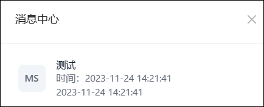
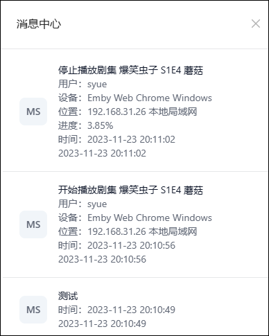
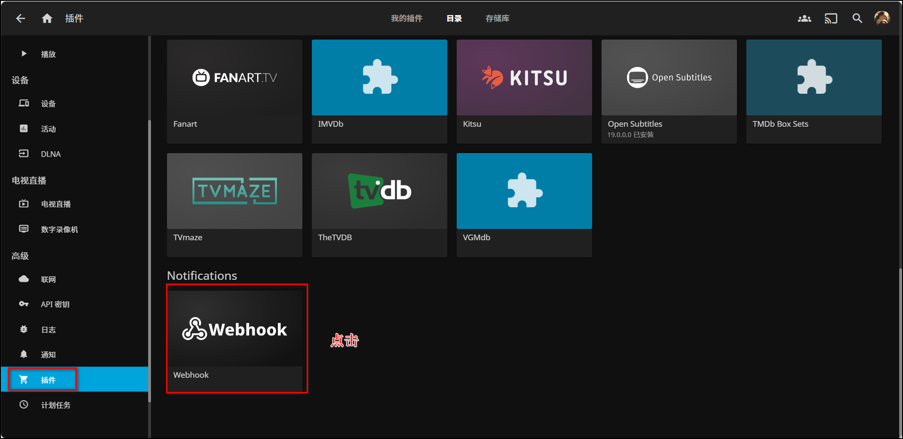

# 🪝 Webhook

Webhook是一种轻量级的回调机制，允许外部服务在特定事件发生时通知Media Saber。通过配置Webhook，您可以实现媒体服务器与Media Saber的实时通信，自动触发相关操作。

## 🎯 支持的媒体服务器

Media Saber支持以下媒体服务器的Webhook集成：

- Emby
- Jellyfin

## 🎬 Emby Webhook配置

### 1. 进入Webhook设置

打开Emby控制台，进入`设置` → `服务器` → `Webhook`，点击`添加Webhook`：


### 2. 配置Webhook参数

填写以下信息：

- **名称**：自定义Webhook名称
- **URL**：`ms地址/api/v1/webhook/emby?apiKey=sk-xxx`
- **请求内容类型**：选择`application/json`

> 🔑 **API Key获取**：在 [我的信息](/docs/main_page/my_info/) 页面 → "安全配置"标签 → "API KEY 管理"中获取或新增API KEY

配置完成后可以点击`发送测试Webhook`验证配置：


### 3. 验证测试消息

配置成功后，Media Saber应该会收到一条测试信息：



### 4. 配置事件和用户

继续选择要触发通知的事件、用户和媒体库，按需选择您想监控的选项：


### 5. 完成配置

填写完所有信息后，点击`添加Webhook`完成配置：


### 6. 测试功能

此时在Emby中操作您刚刚勾选的事件时，Media Saber会收到相关信息通知：



## 🐙 Jellyfin Webhook配置

> GitHub文档说明：<https://github.com/jellyfin/jellyfin-plugin-webhook>

### 1. 安装Webhook插件

打开Jellyfin控制台，进入`插件` → `目录`，找到Webhook插件并点击：



点击`安装Webhook`：


### 2. 重启Jellyfin服务

安装完成后会提示重启Jellyfin服务，按要求重启后状态显示`active`表示成功：


### 3. 配置Webhook

在插件设置中，填写以下信息：

- **Server Url**：Jellyfin服务器URL
- 点击`Add Generic Destination`按钮新增一个Hook

配置以下参数：

- **Webhook Name**：自定义Webhook名称
- **Webhook Url**：`ms地址/jellyfin`
- **Notification Type**：勾选你想触发通知的通知类型
- **User Filter**：勾选你想触发通知的用户
- **Item Type**：勾选你想监控的媒体类型
- **Send All Properties** 和 **Template**：二选一即可，默认勾选`Send All Properties (ignores template)`
- 点击`Add Request Header`，新增一组请求头：
  - Key: `Content-Type`
  - Value: `application/json`

设置完成后点击保存：


### 4. 完成配置

此时Webhook设置完成：


### 5. 测试功能

在Jellyfin中操作您勾选的通知类型时，Media Saber会收到相关信息：


### 6. 调试日志（可选）

如果Webhook未正常工作，可以启用调试日志来排查问题。

编辑`logging.default.json`文件，在文档中的"Serilog"下添加一行内容：

```json
"Jellyfin.Plugin.Webhook": "Debug"
```

记得在`"System": "Warning"`的末尾添加逗号：


## ⚠️ 注意事项

1. **网络连接**：确保Media Saber服务地址可以从媒体服务器访问
2. **API Key配置**：正确配置API Key以确保身份验证通过，详细获取方法请参考 [我的信息 - API KEY管理](/docs/main_page/my_info/#-api-key-管理)
3. **事件选择**：根据实际需求选择合适的事件类型，避免过多不必要的通知
4. **连接监控**：定期检查Webhook连接状态，确保通信正常
5. **性能优化**：在生产环境中建议关闭调试日志以提升性能